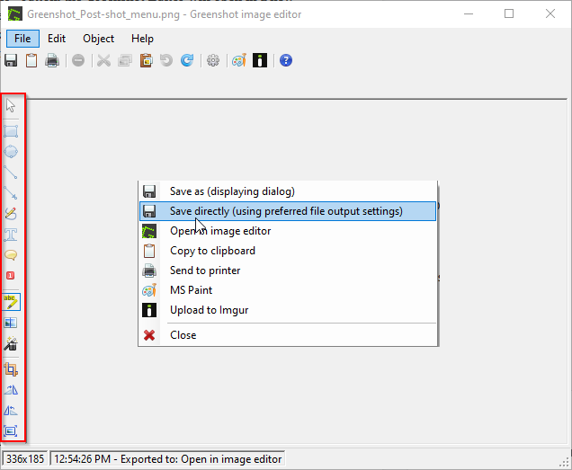

# Annotation Tools
{: .no_toc }

## Table of contents
{: .no_toc .text-delta }

1. TOC
{:toc}

---

## Annotating in the Editor
The Greenshot editor can be used to annotate your photo. Add emphasis, text, or arrows to help contextualize your screenshots. The editor can be accessed after taking a screenshot or by selecting *Open image from file* from the Greenshot menu. Inside the editor, annotation tools are organized along the left side of the interface.

Annotation tools and their functions (from top to bottom): 
* **Draw rectangle**: Draw a box over the image. Options to change the outline and fill colours, as well as for line thickness and drop shadow. 
* **Draw ellipse**: Draw an ellipse over the image. Like the rectangle tool, there are options for fill, line thickness and colour, and drop shadow. 
* **Draw line**: Draw a line over the image. Options for line thickness and colour. 
* **Draw arrow**: Draw an arrow over the image. Options for line thickness, colour, drop shadow, and point direction. 
* **Draw freely**: Draw freely over the image. Options for line thickness and colour.
* **Add textbox**: Place a textbox anywhere over the image. Options for outline thickness, fill, and font styling. 
* **Add speechbubble**: Place a speechbubble that points to a spot on the image. Options for outline thickness, colour, fill, and font styling. 

