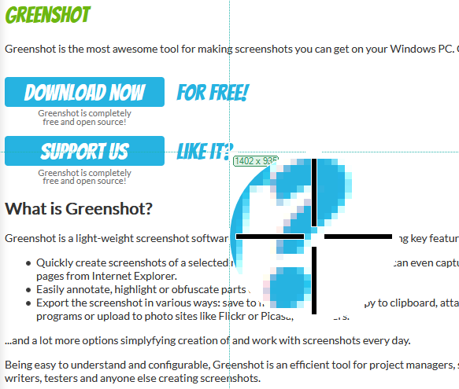
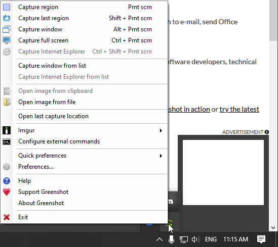
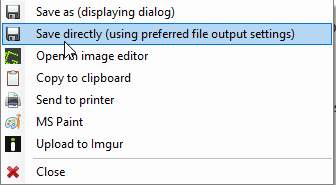

# Capturing Screenshots
{: .no_toc }

## Table of contents
{: .no_toc .text-delta }

1. TOC
{:toc}

---

## Capturing a Screen Region
There are two ways of capturing a screen region with Greenshot: using the keyboard shortcut and using the Greenshot menu. 

#### Using the Keyboard Shortcut
With Greenshot running, press the **[PrtSc]** key on your keyboard to bring up the region capture tool.

#### Using the Greenshot Menu
Alternatively, screen region captures can be taken from the Greenshot menu. The Greenshot menu can be accessed by **[right clicking]** on the Greenshot icon in the system tray (see figure ?). From the menu select *Capture Region*. 

Whichever way you choose to access the region capture tool, after you do so, your cursor will turn into a crosshair with a magnifier preview (see figure ?). Click and drag to trace a box in which the screenshot will capture everything inside. 

*link to after the screenshot*

*insert post screenshot menu screenshot*

## Capture Window
There are two ways of capturing a window with Greenshot: using the keyboard shortcut and using the Greenshot menu. 
 
#### Using the Keyboard Shortcut
With Greenshot running, and the window you want to capture in focus, press **[Alt]** + **[PrtSc]** key on your keyboard. This will capture the contents of the window you are currently focusing on. 

#### Using the Greenshot Menu
Alternatively, window captures can be taken from the Greenshot menu. The Greenshot menu can be accessed by **[right clicking]** on the Greenshot icon in the system tray (see figure ?). From the menu select *Capture Window*. 

If you opt to use the keyboard shortcut, Greenshot will automatically capture the window currently in focus. However, if you access the window capture tool from the menu, your cursor will turn into a crosshair, allowing you to select the window you want to capture (see figure below).

## Capture Entire Screen
There are two ways of capturing your screen with Greenshot: using the keyboard shortcut and using the Greenshot menu. 

#### Using the Keyboard Shortcut
With Greenshot running, press **[Ctrl]** + **[PrtSc]** key on your keyboard. This will capture the contents of  your entire screen. If you are using multiple monitors, the screen that Greenshot will capture is determined by the focused window. If you are focusing on a window on screen two, Greenshot will capture screen two and vice-versa.

#### Using the Greenshot Menu
Alternatively, screen captures can be taken from the Greenshot menu. The Greenshot menu can be accessed by **[right clicking]** on the Greenshot icon in the system tray (see figure ?). From the menu select *Capture Full Screen*. 

Whichever option you use to access the screen capture tool, Greenshot will automatically capture the screen that has a window in focus. However, if you have multiple monitors, Greenshot will give you the additional option of capturing *all* your displays, or just the *left* or *right*. 

*link to after the screenshot*

## After Capturing Your Screen
 After you have taken the screenshot, another menu will appear. From this menu you can choose to save your screenshot to a specified location with *Save as*, save to your default output file location with *Save directly*, open the file in Greenshot’s editor with *Open in image editor*, or send directly to Imgur with *Upload to Imgur*. 

*insert figure whatever* 
