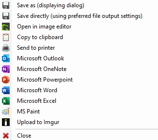
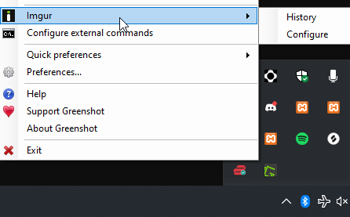
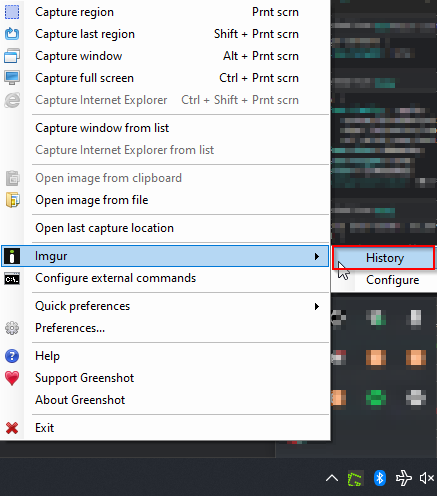

# Imgur Integration
{: .no_toc }

## Table of contents
{: .no_toc .text-delta }

1. TOC
{:toc}

---

## Upload to Imgur

Greenshot offers the convenience of being able to instantly upload screenshots to Imgur. After taking a screenshot, select the Imgur button from the pop out window (Shown in Figure 2 below).

_Figure 2: Greenshot Capture Menu_

After selecting the Imgur button, the file will be uploaded directly to Imgur anonymously. The upload file type used by imgur can be changed by opening greenshot, navigating to the GreenShot Imgur Settings. On windows, open the Windows Task view button and right click on the GreenShot icon, hover over “Imgur” and select configure (See Figure ___ below “GreenshotConfigurationMenu.png”).

_Figure 3: Greenshot Configuration Menu_

A new window will open that allows you to specify the default file type that Greenshot will use to publish Imgur screenshots.

### View Imgur Publish History & Delete Old Posts
In uploading a screenshot to Imgur, Greenshot conveniently keeps a log of all uploads to easily access old screenshots. The history of screenshots can be accessed by navigating to the Greenshot Menu and _selecting_ the “History” button (shown in figure ___ below).

_Figure 3: Greenshot History Menu_

From this menu users can access all old screenshots and even _delete_ screenshots from Imgur from within the Greenshot menu. Items deleted from this menu will be removed from the Imgur website.
