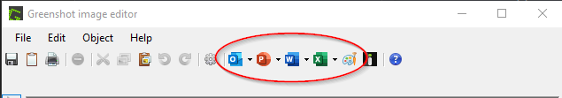
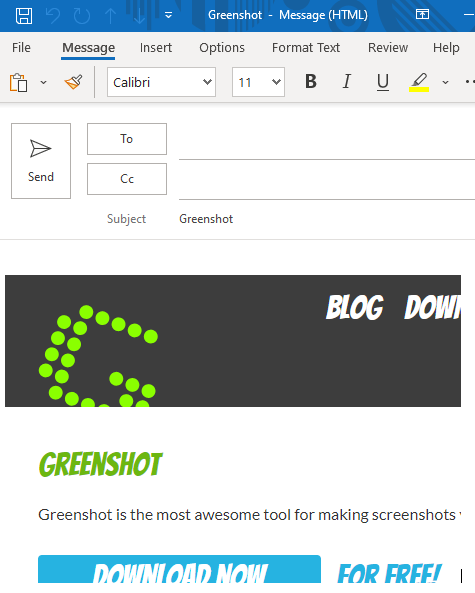
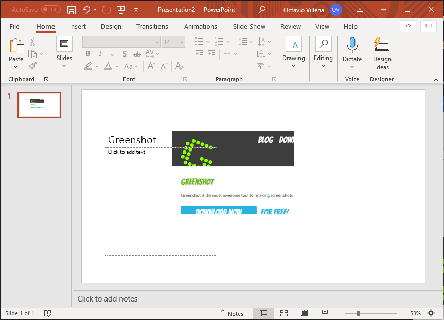
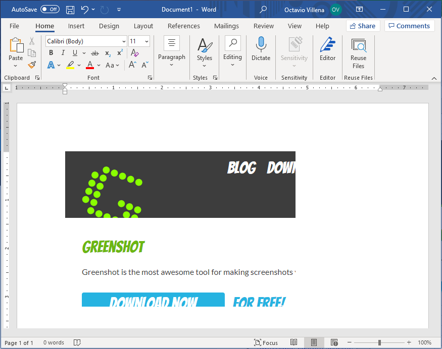
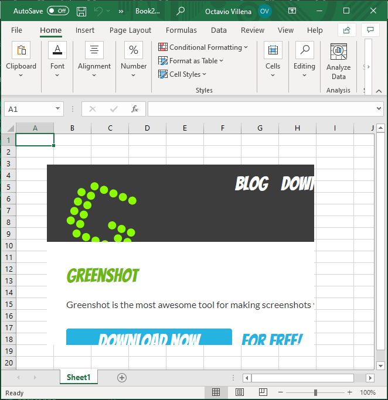
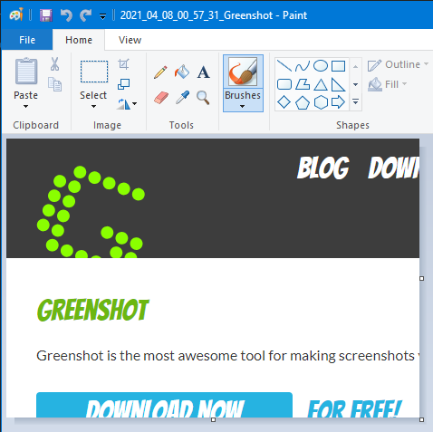
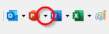
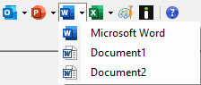

# Inserting Screenshots
{: .no_toc }

## Table of contents
{: .no_toc .text-delta }

1. TOC
{:toc}

---

## Inserting Screenshots into Microsoft Applications

Greenshot lets you insert screenshot images into various Microsoft Applications. These applications include

* Microsoft Outlook
* Microsoft Powerpoint
* Microsoft Word
* Microsoft Excel
* MS Paint

Inserting images into applications can be done through Greenshot's _image editor_ after [taking a screenshot.](./capture)

Application icons can be found at the top of the _image editor_. Clicking any of theses icons will immediately insert your image into it's respective application.

_note:_ The icons marked in the red circle are used to insert images into various Microsoft Applications

### Inserting Screenshot into Microsoft Outlook

Clicking the Microsoft Outlook icon  will open a new Outlook Message window and will insert the image in the email body. The image will be inserted in-line with the text.

### Inserting Screenshot into Microsoft Powerpoint

Clicking the Microsoft Powerpoint icon  will open a new Powerpoint Presentation window and will insert the image in the middle of the first slide. The image will be inserted as a floating image in the slide.

### Inserting Screenshot into Microsoft Word

Clicking the Microsoft Word icon  will open a new Word document window and will insert the image onto the page. The image will be inserted in-line with the text.

### Inserting Screenshot into Microsoft Excel

Clicking the Microsoft Excel icon  will open a new Word document window and will insert the image onto the spreadsheet. The image will be inserted as a floating image over the spreadsheet.

### Inserting Screenshot into MS Paint

Clicking the MS Paint icon  will open the image in a new MS Paint window. The image will now be editable through the MS Paint application.

## Inserting into Already Opened MS Applications

You can insert your image into an existing instance of the Microsoft application.

A _dropdown menu_ is indicated by the arrow icon on the right side of an MS application icon.

Clicking the _dropdown icon_ will reveal a list of the respective application's open windows. The list will reflect the names of the files that you have opened on your desktop.

Clicking on a file/document from the _dropdown menu_ will insert your image into that particular application.
